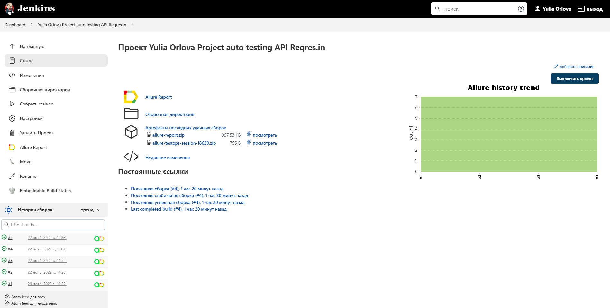
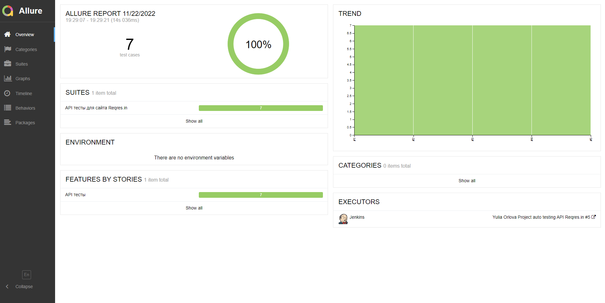
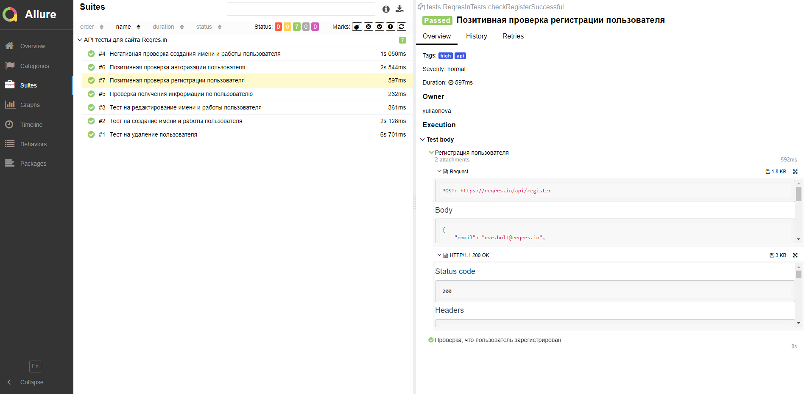
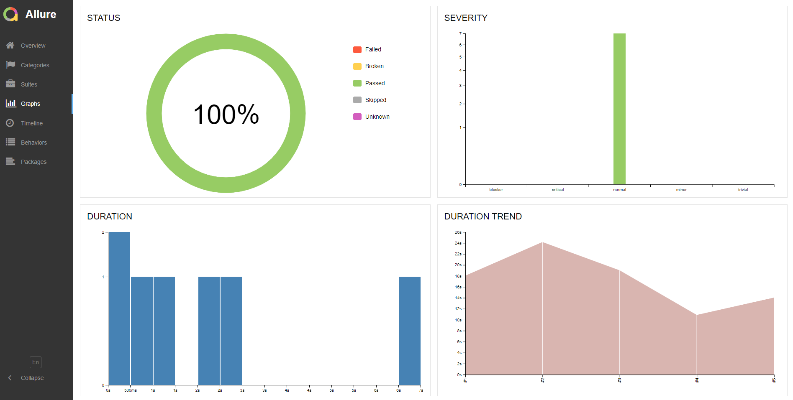
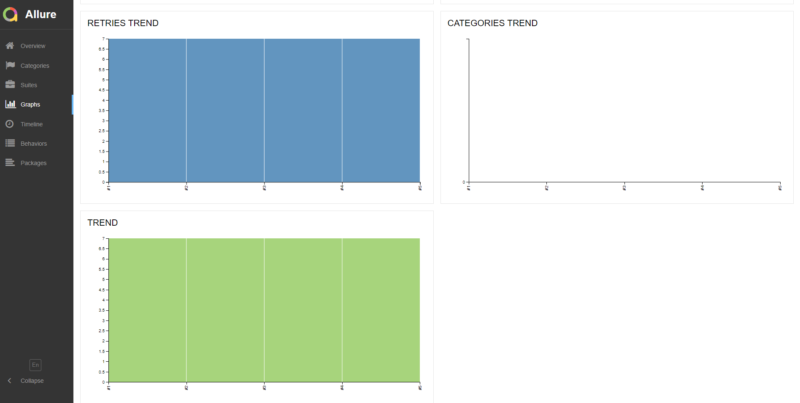
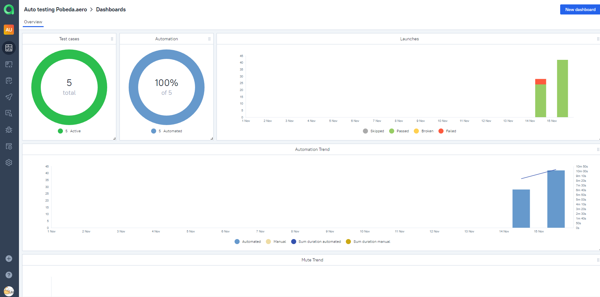
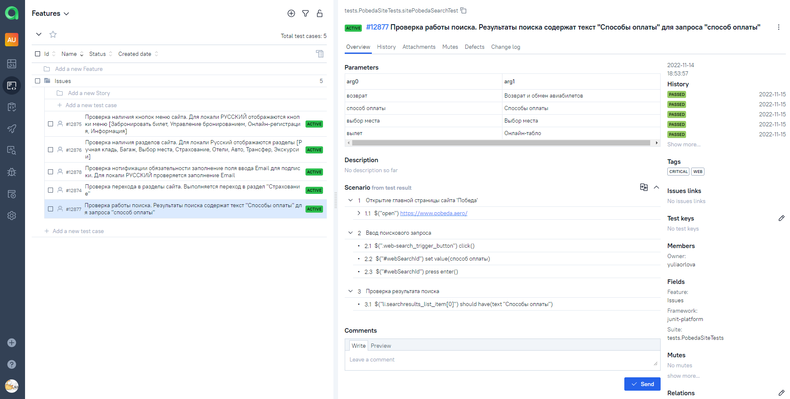
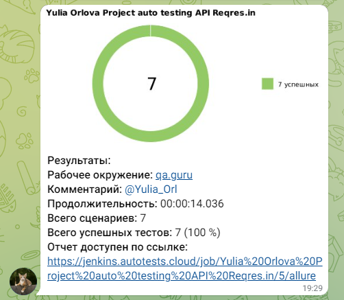

# Проект по автоматизации API тестирования для сайта Reqres.in

## :green_book: Содержание:

- [Использованный стек технологий](#computer-использованный-стек-технологий)
- [Варианты запуска тестов](#running_woman-варианты-запуска-тестов)
- [Сборка в Jenkins](#-сборка-в-jenkins)
- [Allure-отчет](#-allure-отчет)
- [Интеграция с Allure TestOps](#-интеграция-с-allure-testops)
- [Уведомление в Telegram с использованием бота](#-уведомление-в-telegram-с-использованием-бота)

## :computer: Использованный стек технологий

<p align="center">


</p>

Автотесты для REST API написаны на <code>Java</code> с использованием <code>Gradle</code> и <code>JUnit 5</code>.
Для API-тестов используется библиотека Rest-Assured, модели Lombok и спецификации.
Сборка в <code>Jenkins</code> реализована с формированием Allure-отчета и отправкой уведомления с результатами тестирования в <code>Telegram</code> после завершения прохождения тестов.

Allure-отчет включает в себя:
* названия тестов с шагами выполнения;
* тело запроса;
* статус код;
* тело ответа.

## :running_woman: Варианты запуска тестов

### Локальный запуск тестов
Для локального запуска необходимо выполнить команду в терминале:
```
gradle clean test
```

##  Сборка в Jenkins
### <a target="_blank" href="https://jenkins.autotests.cloud/job/Auto%20testing%20main%20page%20Pobeda.aero/">*Jenkins job*</a>

<p align="center">

</p>

##  Allure-отчет
### <a target="_blank" href="https://jenkins.autotests.cloud/job/Auto%20testing%20main%20page%20Pobeda.aero/10/allure/">*Overview*</a>

<p align="center">

</p>

### *Результат прохождения параметризованных тестов с описанием  и шагами выполнения*

<p align="center">

</p>

### *Графики*
<p align="center">

</p>
<p align="center">

</p>

##  Интеграция с Allure TestOps
### *Allure TestOps* <a target="_blank" href="https://allure.autotests.cloud/project/1669/dashboards">*Dashboard*</a>

<p align="center">  
  
</p>  

### *Тест кейсы*

<p align="center">  
  
</p>

##  Уведомление в Telegram с использованием бота

После завершения сборки специальный бот, созданный в <code>Telegram</code>, автоматически отправляет сообщение с отчетом прохождения тестов.

<p align="center">

</p>
